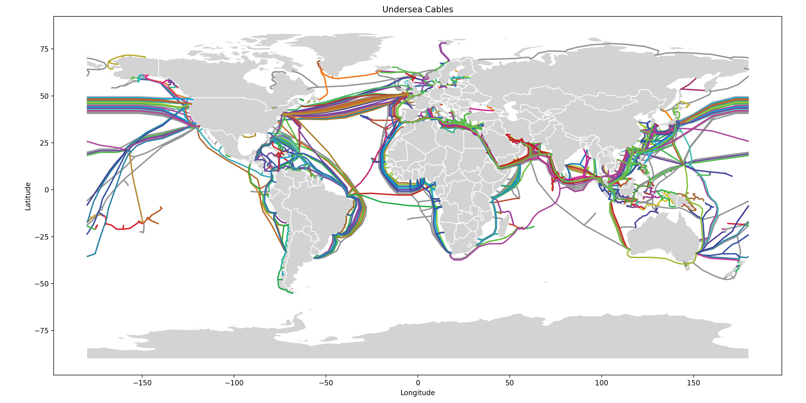

# qc-dsai

## Quantum Computing, Data Science, and AI Project

This repository contains materials and code related to the Quantum Computing, Data Science, and AI project, focusing on data science techniques applied to a real-world dataset.

### Overview

This project demonstrates data science workflows, including data cleaning, geo-enrichment, network analysis, and visualization, using the undersea cable dataset.

The project includes a visualization of undersea cables across the globe:



### Contents

*   **`peter.ipynb`:** A Jupyter Notebook containing the complete data science workflow, from data loading and cleaning to network analysis and visualization of undersea cables.  This notebook demonstrates the use of libraries such as `geopandas`, `networkx`, `matplotlib`, and `shapely`.
*   **`undersea_cables_world.png`:** A static map visualization of the undersea cable network generated by the `peter.ipynb` notebook.
*   **`map_data/`:** Contains the `ne_110m_admin_0_countries` shapefile used for creating the world basemap in the visualizations.  (Data from Natural Earth).
*   **`README.md`:** This file, providing an overview of the project.

### Setup

1.  **Clone the repository:**

    ```bash
    git clone https://github.com/kovy21/qc-dsai/
    cd qc-dsai
    ```

2.  **Install dependencies:**

    A `requirements.txt` file is not explicitly provided, but the notebook relies on the following libraries.  Install them using pip:

    ```bash
    pip install geopandas networkx matplotlib shapely kagglehub pandas
    ```

### Usage

*   Open and run the `peter.ipynb` Jupyter Notebook to reproduce the analysis and visualizations.  Ensure you have installed the necessary dependencies.
*   The `undersea_cables_world.png` file provides a quick overview of the undersea cable network.
*   The `map_data` directory contains the shapefile necessary to generate the map.

### Contributing

Contributions are welcome! Please follow these steps:

1.  Fork the repository.
2.  Create a new branch for your feature or bug fix.
3.  Implement your changes.
4.  Submit a pull request.

### License

MIT License